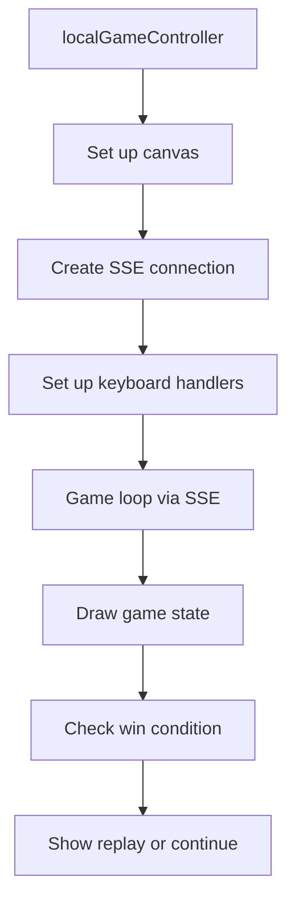
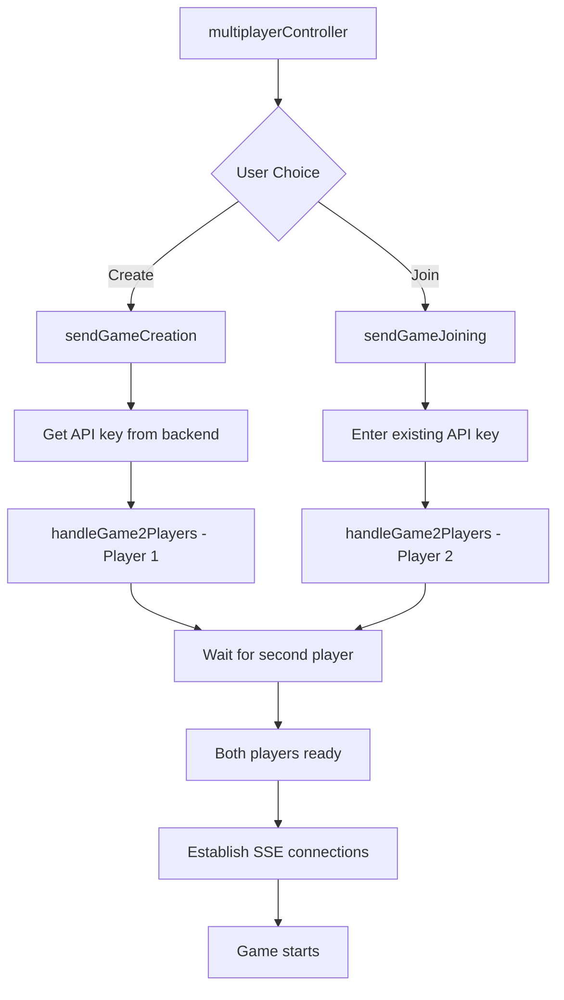

# Frontend Game Features Documentation

This document explains how the frontend game system works in the transcendence project, covering all game modes, SSE management, and event handling.

## 📁 File Structure

```
frontend/js/views/
├── gameApi.js              # API communication functions
├── gameCanvas.js           # Canvas drawing utilities
├── gameCreation.js         # Multiplayer game creation logic
├── gameJoining.js          # Multiplayer game joining logic
├── localGame.js            # Local/AI game implementation
├── multiplayer.js          # Multiplayer controller
├── multiplayerGameSession.js # Multiplayer game session management
├── singlePlay.js           # Single player controller
└── versusGame.js           # Local versus game controller
```

## 🎮 Game Modes Overview

### 1. **Single Player** (`singlePlay.js`)
- Player vs AI
- Simple controller that sets up canvas and loads local game

### 2. **Local Multiplayer** (`versusGame.js`, `localGame.js`)
- Two players on same device
- Uses `localGame.js` for game logic

### 3. **Online Multiplayer** (`multiplayer.js`, `multiplayerGameSession.js`)
- Two players over network
- Real-time communication via SSE
- Game rooms with API keys

---

## 🔧 Core Components

### `gameApi.js` - API Communication
```javascript
// Player name management for local games
setPlayersLocalName(apikey)     // Store local game API key
getPlayersLocalName()           // Retrieve local game API key

// Multiplayer API functions
setApiKeyWeb(apiKey)           // Join/register for multiplayer game
loadGamePlayable(apikey)       // Check if multiplayer game is ready
setApiKeyWebSP(apikey)         // Set API key for special games
```

**Purpose**: Centralized API communication for game setup and status checking.

### `gameCanvas.js` - Drawing Utilities
```javascript
setCanvasAndContext()          // Initialize canvas and get context
sleep(ms)                      // Async delay utility
drawMap(ballPos, player1, player2) // Draw game field with players and ball

// Drawing helpers
roundRect(ctx, x, y, w, h, r)  // Draw rounded rectangle
fillCircle(ctx, x, y, r)       // Draw filled circle
```

**Purpose**: Provides all canvas drawing functions used across different game modes.

---

## 🎯 Game Flow Architecture

### Local Game Flow (`localGame.js`)



#### Key Functions:
```javascript
localGameController()          // Main entry point
cleanupLocalGame()            // Clean up all resources
checkwin()                    // Handle game end state
```

#### SSE Management:
- **Connection**: Creates EventSource for real-time game updates
- **Error Handling**: Automatic reconnection with exponential backoff
- **Cleanup**: Proper connection closure on page leave

#### Event Listeners:
- **Keyboard**: Arrow keys for player movement, spacebar for actions
- **Cleanup**: `beforeunload`, `hashchange` for proper resource cleanup
- **Replay**: Button handler for game restart

### Multiplayer Game Flow



---

## 🔗 Multiplayer System Deep Dive

### Game Creation Flow (`gameCreation.js`)
```javascript
sendGameCreation()
├── Load UI template (matchCreation.html)
├── Request new API key from backend
├── Display API key to user
├── Poll for second player
└── Start handleGame2Players(key, 1, 0, -1) when ready
```

### Game Joining Flow (`gameJoining.js`)
```javascript
sendGameJoining()
├── Load UI template (matchJoining.html)
├── Get API key input from user
├── Validate API key with backend
├── Show waiting state
└── Start handleGame2Players(key, 2, 0, -1) when valid
```

### Session Management (`multiplayerGameSession.js`)

#### Core Function:
```javascript
handleGame2Players(key, playerID, isAiGame, JWTid)
```

**Parameters:**
- `key`: API key for the game room
- `playerID`: 1 for host, 2 for joiner
- `isAiGame`: 0 for multiplayer, 1 for AI
- `JWTid`: JWT token ID

#### Flow:
1. **Setup Phase**
   ```javascript
   // Store game globals
   currentMultiplayerApiKey = key;
   multiplayerGameStarted = false;
   
   // Get player info
   await fetchWithRefresh('server-pong/check-sse')
   ```

2. **Wait for Game Ready**
   ```javascript
   waitForGameReady(key, playerID, ...)
   ├── Poll backend every 500ms
   ├── Check game status
   └── Proceed when "Game can start"
   ```

3. **Establish SSE Connection**
   ```javascript
   establishSSEConnection(key, playerID, ...)
   ├── Create EventSource with game parameters
   ├── Set up message handlers
   ├── Set up keyboard controls
   └── Start game loop
   ```

---

## 📡 SSE (Server-Sent Events) Management

### Connection Setup
```javascript
// URL format for multiplayer SSE
const url_sse = `server-pong/events?apikey=${key}&idplayer=${playerID}&ai=${isAiGame}&JWTid=${JWTid}&username=${username}`;

const SSEStream = new EventSource(url_sse);
```

### Event Handlers
```javascript
SSEStream.onmessage = function(event) {
    const data = JSON.parse(event.data);
    const game_stats = data["game_stats"];
    
    // Update game state
    drawMap(game_stats["ball"]["position"], 
            game_stats["player1"], 
            game_stats["player2"]);
    
    // Update scores
    updateScores(game_stats["team1Score"], game_stats["team2Score"]);
    
    // Check win condition
    checkwin();
};

SSEStream.onerror = function(event) {
    // Handle connection errors
    // Implement reconnection logic
};
```

### Cleanup Management
```javascript
cleanupMultiplayerGame() {
    // Close SSE connection
    if (multiplayerSSEConnection) {
        multiplayerSSEConnection.close();
        multiplayerSSEConnection = null;
    }
    
    // Remove event listeners
    if (multiplayerKeydownHandler) {
        document.removeEventListener('keydown', multiplayerKeydownHandler);
        multiplayerKeydownHandler = null;
    }
    
    // Reset game state
    multiplayerGameStarted = false;
    multiplayerGameEnded = false;
}
```

---

## ⌨️ Event Listener Management

### Pattern Used Across All Game Modes
```javascript
// Store handler reference for cleanup
let keydownHandler = null;

// Create handler function
keydownHandler = function(event) {
    // Handle keyboard input
};

// Add listener
document.addEventListener('keydown', keydownHandler);

// Cleanup (important!)
function cleanup() {
    if (keydownHandler) {
        document.removeEventListener('keydown', keydownHandler);
        keydownHandler = null;
    }
}
```

### Local Game Controls
- **Arrow Keys**: Player 1 movement (up/down)
- **W/S Keys**: Player 2 movement (up/down)
- **Spacebar**: Start game
- **R**: Restart game

### Multiplayer Game Controls
- **Arrow Keys**: Current player movement
- **P Key**: Start game (any player can start)
- **Q/L Keys**: Forfeit game

### Page Navigation Cleanup
```javascript
// Prevent memory leaks on navigation
window.addEventListener('beforeunload', cleanupFunction);
window.addEventListener('hashchange', cleanupFunction);
window.addEventListener('pagehide', cleanupFunction);
```

---

## 🔄 Game State Management

### Local Games
```javascript
// Global state variables
let gameInterval = null;
let sseConnection = null;
let gameStarted = false;
let gameEnded = false;
```

### Multiplayer Games
```javascript
// Multiplayer-specific state
let multiplayerGameInterval = null;
let multiplayerSSEConnection = null;
let multiplayerGameStarted = false;
let multiplayerGameEnded = false;
let currentMultiplayerApiKey = null;
```

### State Transitions
1. **Initialization**: Reset all flags, clean previous state
2. **Waiting**: Show waiting messages, poll for readiness
3. **Ready**: Display "Press P to start" message
4. **Playing**: Active game loop, handle input, update display
5. **Ended**: Show results, handle cleanup

---

## 🎨 UI Template System

### Template Loading Pattern
```javascript
// Load HTML template
const response = await fetch('./templates/templateName.html');
const htmlContent = await response.text();

// Insert into DOM
const gameState = document.getElementById("targetContainer");
gameState.innerHTML = htmlContent;

// Set up event listeners for new elements
setupEventListeners();
```

### Templates Used
- `singlePlay.html`: Single player UI with replay button
- `multiplayer.html`: Multiplayer lobby with create/join buttons
- `matchCreation.html`: Game creation interface
- `matchJoining.html`: Game joining interface
- `localGame.html`: Footer with player info and scores

---

## 🔧 Error Handling & Robustness

### SSE Error Recovery
```javascript
SSEStream.onerror = function(event) {
    if (SSEStream.readyState === EventSource.CLOSED) {
        console.warn("Connection closed by server");
    } else if (SSEStream.readyState === EventSource.CONNECTING) {
        console.warn("Reconnecting...");
    }
    // Implement exponential backoff for reconnection
};
```

### API Error Handling
```javascript
try {
    const response = await fetchWithRefresh(url, options);
    if (!response.ok) {
        throw new Error(`HTTP ${response.status}`);
    }
    // Handle success
} catch (error) {
    console.error('API Error:', error);
    // Fallback behavior
}
```

### Memory Leak Prevention
- Always remove event listeners in cleanup functions
- Close SSE connections properly
- Clear intervals and timeouts
- Reset global state variables

---

## 🔍 Debugging & Monitoring

### Console Logging
- Game state transitions
- SSE connection status
- API call results
- Error conditions

### Debug Information
```javascript
console.log('Starting handleGame2Players with:', {
    key, playerID, isAiGame, JWTid
});
```

---

## 🚀 Best Practices Implemented

1. **Single Responsibility**: Each file handles one aspect of the game system
2. **Proper Cleanup**: All resources are cleaned up on navigation
3. **Error Handling**: Comprehensive error handling with fallbacks
4. **State Management**: Clear separation of local vs multiplayer state
5. **Event Management**: Proper listener addition/removal patterns
6. **SSE Management**: Robust connection handling with cleanup
7. **Template System**: Clean separation of HTML and JavaScript
8. **API Abstraction**: Centralized API functions for reusability

This architecture ensures robust, maintainable game functionality with proper resource management and excellent user experience across all game modes.